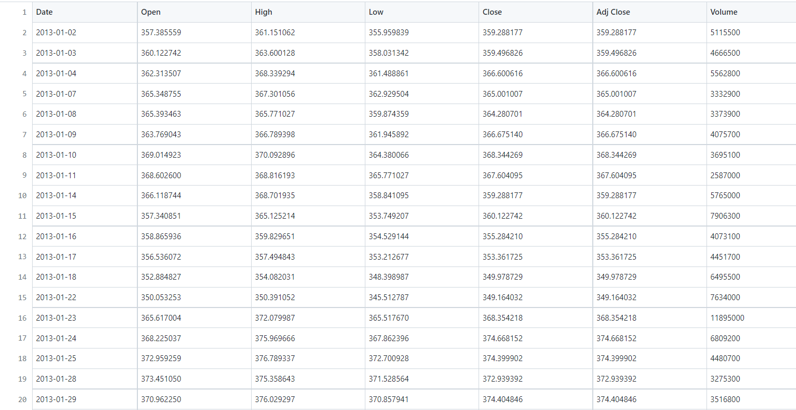
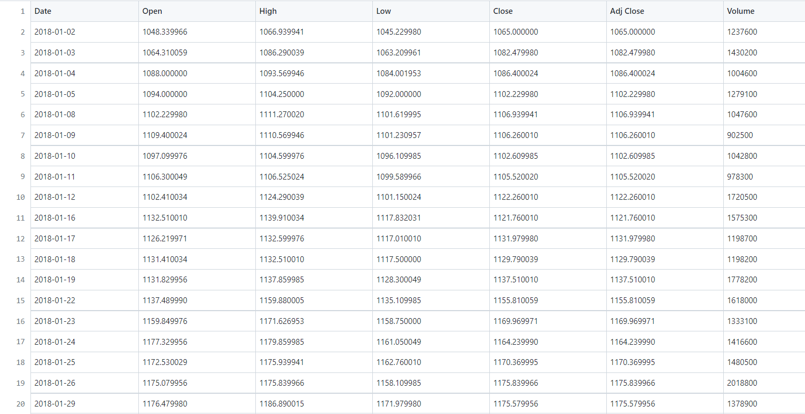
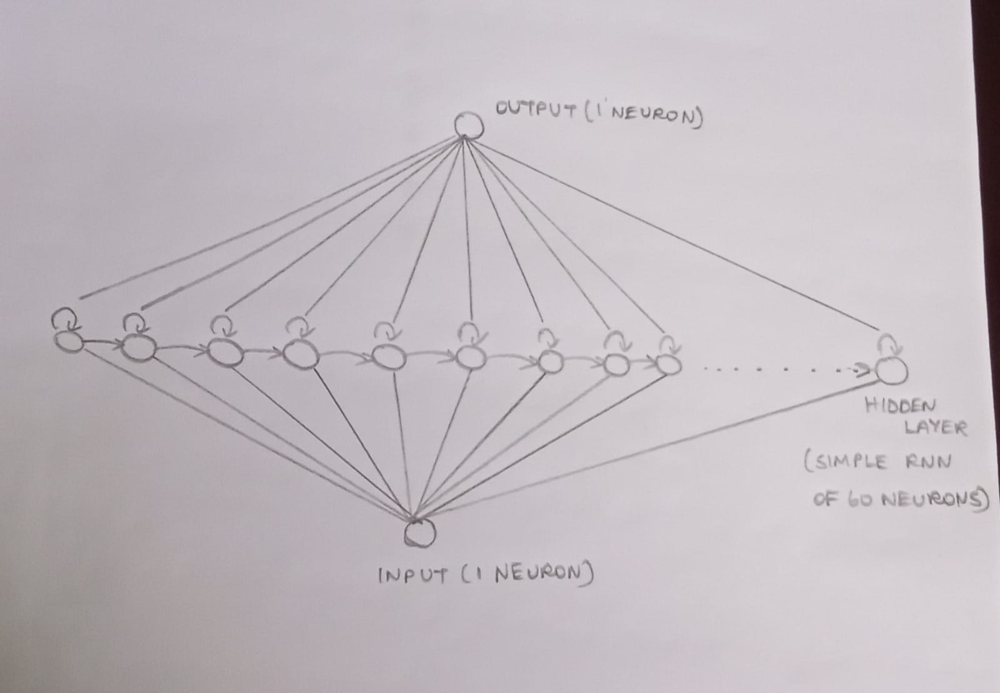
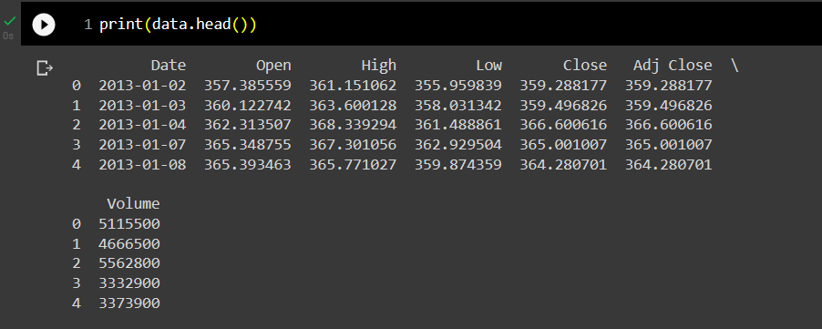
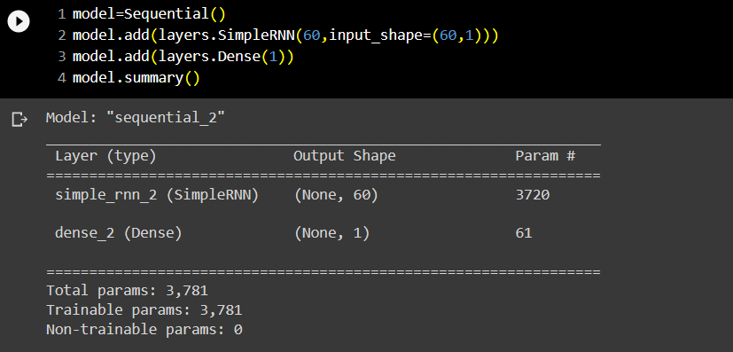
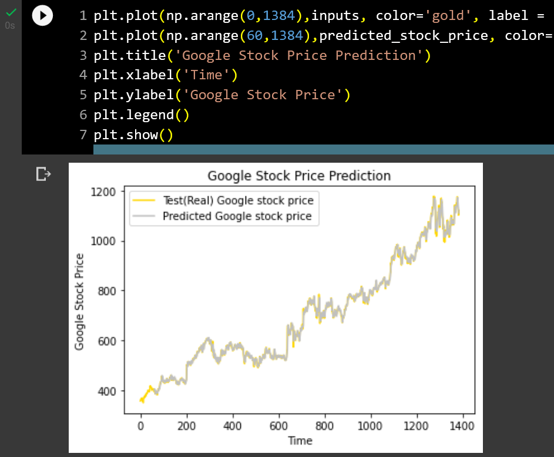
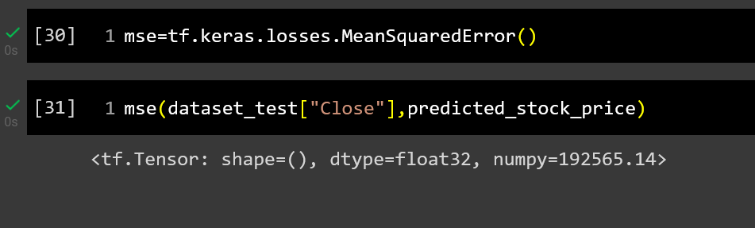

# Stock Price Prediction...

## AIM:

To develop a Recurrent Neural Network model for stock price prediction.

## PROBLEM STATEMENT:

Stock Price Prediction using machine learning is the process of predicting the future value of a stock traded on a stock exchange for reaping profits. With multiple factors involved in predicting stock prices, it is challenging to predict stock prices with high accuracy, and this is where machine learning plays a vital role.

Predicting how the stock market will perform is a hard task to do. There are other factors involved in the prediction, such as physical and psychological factors, rational and irrational behavior, and so on. All these factors combine to make share prices dynamic and volatile. This makes it very difficult to predict stock prices with high accuracy. 

## DATASET:

### TRAINSET.CSV:



### TESTSET.CSV:



## NEURAL NETWORK MODEL:



## DESIGN STEPS:

### STEP 1:

Download and load the dataset to colab. After that access the dataset to perform training and testing.

### STEP 2:

Use MinMaxScalar to transform features by scaling each feature to a given range (between zero and one).

### STEP 3:

Split the data into training set and testing set.

### STEP 4:

Build the Recurrent Neural network model (RNN) for the prediction of stock price.

### STEP 5:

Train the model using the training data (trainset.csv) file.

### STEP 6:

Plot the performance of the model using the testing data (testset.csv) file.

### STEP 7:

Plot the graph of the training and testing models.

### STEP 8:

End the program.

## PROGRAM:

```python

### Developed by: Anto Richard.S
### Reg.No: 212221240005
Program to develop a Recurrent Neural Network model for stock price prediction.

import numpy as np
import matplotlib.pyplot as plt
import pandas as pd
from sklearn.preprocessing import MinMaxScaler
from keras import layers
from keras.models import Sequential
import tensorflow as tf

data = pd.read_csv('trainset.csv')

print(data.columns)

print(data.head())

training_set = data.iloc[:,1:2].values

type(training_set)

print(training_set.shape)

sc = MinMaxScaler(feature_range=(0,1))
training_set_scaled = sc.fit_transform(training_set)

print(training_set_scaled.shape)

X_train_arr = []
y_train_arr = []
for i in range(60, 1259):
    X_train_arr.append(training_set_scaled[i-60:i,0])
    y_train_arr.append(training_set_scaled[i,0])
X_train, y_train = np.array(X_train_arr), np.array(y_train_arr)
X_train1 = X_train.reshape((X_train.shape[0], X_train.shape[1],1))

print(X_train.shape)

length = 60
n_features = 1

model=Sequential()
model.add(layers.SimpleRNN(60,input_shape=(60,1)))
model.add(layers.Dense(1))
model.summary()

model.compile(optimizer='adam', loss='mse')
model.summary()

model.fit(X_train1,y_train,epochs=200, batch_size=64)

dataset_test = pd.read_csv('testset.csv')

test_set = dataset_test.iloc[:,1:2].values

test_set.shape

dataset_total = pd.concat((data['Open'],dataset_test['Open']),axis=0)

inputs = dataset_total.values
inputs = inputs.reshape(-1,1)
inputs_scaled=sc.transform(inputs)
X_test = []
for i in range(60,1384):
    X_test.append(inputs_scaled[i-60:i,0])
X_test = np.array(X_test)
X_test = np.reshape(X_test,(X_test.shape[0], X_test.shape[1],1))

print(X_test.shape)

predicted_stock_price_scaled = model.predict(X_test)
predicted_stock_price = sc.inverse_transform(predicted_stock_price_scaled)

plt.plot(np.arange(0,1384),inputs, color='gold', label = 'Test(Real) Google stock price')
plt.plot(np.arange(60,1384),predicted_stock_price, color='silver', label = 'Predicted Google stock price')
plt.title('Google Stock Price Prediction')
plt.xlabel('Time')
plt.ylabel('Google Stock Price')
plt.legend()
plt.show()

mse=tf.keras.losses.MeanSquaredError()

mse(dataset_test["Close"],predicted_stock_price)

```

## OUTPUT:

### Data.head():



### Model.summary():



### True Stock Price, Predicted Stock Price vs time:



### Mean Square Error:



## RESULT:

Thus, a Recurrent Neural Network model (RNN) for stock price prediction is developed and executted successfully.
